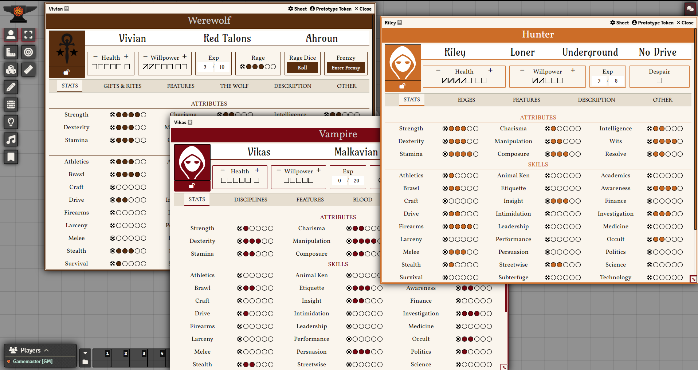

# World of Darkness 5e System

[![Foundry Shield 11]][Foundry URL]
[![MIT License]][MIT URL]
[![GitHub Super-Linter]][Super-Linter URL]

This system is for playing multiple World of Darkness 5th edition systems on the Foundry Virtual Tabletop System. For a list of the latest changes, see [Changelog.md](https://veilza.github.io/wod5e-docs/changelog.html)

Current supported systems include:
* Vampire the Masquerade, 5th Edition
* Hunter the Reckoning, 5th Edition
* Werewolf the Apocalypse, 5th Edition

## Dice

The system has integration with Dice So Nice!

The information for how to roll the splat-unique dice is like so:
* To roll Vampire dice, roll `1dv`. To roll Hunger dice, roll `1dg`.
* To roll Hunter dice, roll `1dh`. To roll Desperation dice, roll `1ds`.
* To roll Werewolf dice, roll `1dw`. To roll Rage dice, roll `1dr`.

Replace the 1s with however many you want to roll for each type, and let the dice roll!

## Feedback

Bugs or feature requests created to this repository are greatly appreciate. Please use the [Issues](https://github.com/Rayji96/foundry-V5/issues) page for these!

Please reach out to me at "weinerdolphin" or "veilza" on Discord with any pressing issues, I'd love to help you get your game running smoothly!

Please check the issues list before suggesting new features.

## Credits

Huge thanks to these folks for their contributions!

### System Contributors
* Addition of Hunter sheets and SPC sheets by [MrDionysus] (MrDionysus#9673)
* Features improvements and custom roll table by [Veichassur]
* Limited character sheet by [pedroboh]
* Character sheet lock by [Varkal]
* CSS improvements by [lipefl]
* Incredible work on dot and box counters by [erizocosmico]
* Refactors and enhancements by [bmgraves]
* Partial HTML, character types, migrations, bugfixes, and refactors by [Dakayl]
* In-chat willpower rerolling, dark theme, Werewolf v5 support, and numerous other features and fixes by [Veilza]
* Adding blood potency bonus to discipline rolls by [MarkusOzgur]
* Various upgrades and CSS design improvements by [LorduFreeman]
* Dicebox by [crcroberts]

### Localization Contributors
* French localization started by @Lloyxide#6914
* Italian localization started by @Arcadio21#8780
* Help with french localization by [Lemantia]
* Brazilian Portuguese localization started by [danielmalka]
* German localization started and maintained by [tom959]
* Spanish localization started by [erizocosmico]
* Spanish localization help by [Musrha]
* Polish localization help by [gbursson]
* Russian localization help by [Xuula]

### Additional Contributions
* This system was initially based on the [boilerplate system] by @asacolips#1867
* Icons used with permissions from [cftarbay]
* Feedback and fixes by [eisenfuchs]
* Feedback and fixes by @OldMightyFriendlyGamer#0832
* Initial testing and DiceSoNice feedback by Clement#1490
## Dark Pack

[![Dark Pack]][Dark Pack URL]

Licensed WoD 5e materials will not be provided as this system is provided for public usage, for free. We have made every effort to keep the Dark Pack guidelines as posted at [Dark Pack Agreement].

[Foundry Shield 11]: https://img.shields.io/badge/Foundry-11-informational
[Foundry URL]: https://foundryvtt.com

[MIT License]: https://img.shields.io/badge/License-MIT-green
[MIT URL]: https://github.com/Rayji96/foundry-V5/blob/main/LICENSE

[GitHub Super-Linter]: https://github.com/Rayji96/foundry-V5/workflows/Super-Linter/badge.svg
[Super-Linter URL]: https://github.com/marketplace/actions/super-linter

[Dark Pack]: https://s3-eu-north-1.amazonaws.com/pdx-campaign-wp-data/uploads/sites/10/2021/10/05102936/darkpack_logo2-300x300.png
[Dark Pack URL]: https://www.paradoxinteractive.com/games/world-of-darkness/community/dark-pack-agreement
[Dark Pack Agreement]: https://www.paradoxinteractive.com/games/world-of-darkness/community/dark-pack-agreement

[boilerplate system]: https://gitlab.com/asacolips-projects/foundry-mods/foundryvtt-system-tutorial
[danielmalka]: https://github.com/danielmalka
[cftarbay]: https://github.com/cftarbay
[lipefl]: https://github.com/lipefl
[erizocosmico]: https://github.com/erizocosmico
[tom959]: https://github.com/tom959
[bmgraves]: https://github.com/bmgraves
[eisenfuchs]: https://github.com/eisenfuchs
[Veichassur]: https://github.com/Veichassur
[pedroboh]: https://github.com/pedroboh
[Lemantia]: https://github.com/Lemantia
[Varkal]: https://github.com/Varkal
[Dakayl]: https://github.com/Dakayl
[Veilza]: https://github.com/Veilza
[MarkusOzgur]: https://github.com/MarkusOzgur
[Musrha]: https://github.com/Musrha
[crcroberts]: https://github.com/crcroberts
[gbursson]: https://github.com/gbursson
[MrDionysus]: https://github.com/MrDionysus
[LorduFreeman]: https://github.com/LorduFreeman
[Xuula]: https://github.com/Xuula